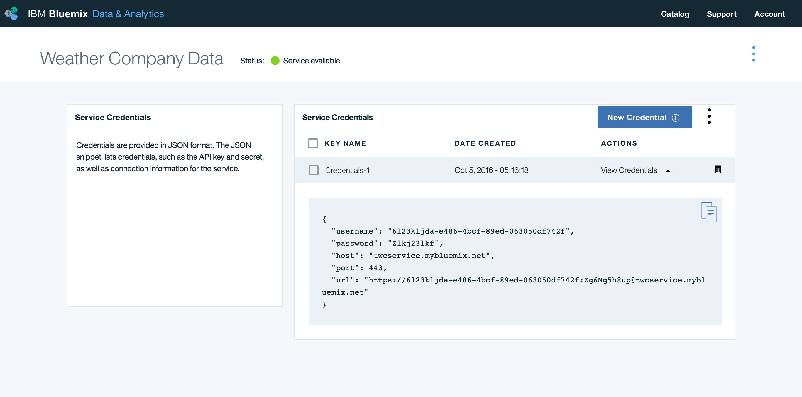

## Weather
IBM Cloud Mobile Starter for Weather in Swift

[](https://bluemix.net)
[](https://developer.apple.com/swift/)

### Table of Contents
* [Summary](#summary)
* [Requirements](#requirements)
* [Configuration](#configuration)
* [Run](#run)
* [License](#license)

### Summary

The IBM Cloud Mobile Starter for Weather showcases the integration of forecast data from IBM Insights for Weather API with Apple Maps.

### Requirements
* iOS 9.0+
* Xcode 9.0
* Swift 4.0

### Configuration
* [IBM Cloud Mobile services and Weather Dependency Management](#bluemix-mobile-services-and-weather-dependency-management)
* [Weather Credential Management](#weather-credential-management)

#### IBM Cloud Mobile services and Weather Dependency Management
This starter uses the IBM Cloud Mobile services SDKs to use the functionality of the Mobile Analytics and Weather services.

The IBM Cloud Mobile services SDK uses [CocoaPods](https://cocoapods.org/) to manage and configure dependencies.

Install CocoaPods using the following command:

```bash
$ sudo gem install cocoapods
```

If the CocoaPods repository is not configured, run the following command:

```bash
$ pod setup
```

For this starter, a pre-configured `Podfile` has been included. To download and install the required dependencies, run the following command:

```bash
$ pod install
```
Open the Xcode workspace: `{APP_Name}.xcworkspace`. Continue to open the `.xcworkspace` file as it contains all the dependencies and configurations.

If you run into any issues during the pod install, it is recommended to run a pod update by using the following commands:

```bash
$ pod update
$ pod install
```

> [View configuration](#configuration)

#### Weather Credential Management
Once the dependencies have been built and configured for the IBM Cloud Mobile service SDKs, configure the Weather credentials for the application. If you have not already created the Weather service on IBM Cloud, go to the [IBM Cloud Catalog](https://new-console.ng.bluemix.net/catalog/) and create a [Weather](https://new-console.ng.bluemix.net/catalog/services/weather-company-data/) service instance.

A `BMSCredentials.plist` configuration file is included in the Xcode project that includes credential configurations for Weather service:

| Key              | Value           |
| :-------------:  |:-------------:|
| host          | twcservice.mybluemix.net |
| username      | my-weather-username |
| password      | my-weather-password |

Find the credentials for your Weather Insights service by clicking the **Service Credentials** button:



> [View configuration](#configuration)


### Run

Click **Product > Run** to start the app in Xcode.


The application allows you determine the forecast of any location using your Weather instance on IBM Cloud. Long click to view the forecast.

### License
This package contains code licensed under the Apache License, Version 2.0 (the "License"). You may obtain a copy of the License at http://www.apache.org/licenses/LICENSE-2.0 and may also view the License in the LICENSE file within this package.
